
<b>Marketshare</b> is a fictional eCommerce website built using a microservice arquitecture combining multiple technologies deployed on a local cluster.

  
  
  
  
  
  
  
  
  
  
  
  
  
  
  
  
  

# About
The application was developed to be submmited as my final project for the course **Desarrollo de aplicaciones en la nube** (cloud-based application development) that I took as part of my undergrad degree in [Ingeniería en Sistemas de Información](https://utn.edu.ar/es/federacion-universitaria-tecnologica/feria-de-carreras/sistemas-de-informacion) (Information Systems Engineering) from [Universidad Tecnológica Nacional](https://utn.edu.ar/es/).

This was made for learning purposes only. Some functionality is incomplete and some cuestionable decision were made along the way. Don't expect it to be bugs-free (it's really buggy :lady_beetle: :beetle: :cockroach: )

# Overview
Marketshare is an eCommerce website intended as a B2B solution where users can create *seller* or *consumer* accounts. These account types are also referred to as *roles*.

- **Sellers**: users that represent business and can publish their products catalog.
- **Consumers**: they also represent business and are capable of purchasing and rating products by creating purchase orders.

Each user has access to data that is role-specific and account-specific. 
For instance, *sellers* are allowed to create and modify products. On their profile, *consumers* can list their purchases, track orders status and get analytics like total money spent, biggest purchase, etc.

## Architecture

The following is a diagram of the application running inside a kubernetes cluster with [minikube](https://minikube.sigs.k8s.io/docs/).

External users access the cluster through the [HAProxy](https://haproxy-ingress.github.io/docs/configuration/gateway-api/) API Gateway's public IP on port 80.
This request gets redirected to the internal *frontend* service, which targets any pod running the `frontend microservice`.

From there, communication between services to collect necessary data happens completely within the cluster (expect for MongoDB database queries, which is hosted on the cloud using [Atlas](https://www.mongodb.com/products/platform/atlas-database)). Microservices and database servers (mySQL, postgreSQL and RabbitMQ) reside in separated pods and thus only accessed through the network.

Networking is handled by a `linkerd` service mesh by running proxies in-between any API request. This deployment forms the linkerd's *data plane*. 

The data plane is used to collect metrics with `Prometheus` and feed them through a `Grafana` dashboard. To achieve this swiftly integration, [linkerd's viz extension](https://linkerd.io/2.15/reference/cli/viz/) allows for its Prometheus instance to be [hooked with a Grafana service](https://linkerd.io/2.15/tasks/grafana/) installed with `Helm`.

Throughout the cluster, authorization tokens managed by an `authorization microservice` are exchanged as all API requests require origin validation with an *Authorization* header. Access token are issued per user and different endpoint access is granted according to their role.

The application is composed of 6 microservices. The following section outlines their purposes.

# Microservices
### Frontend

  
  
  
  

The frontend serves the web UI to the clients and relies on the app's *backend* to manage users' data. Along with the API Gateway, it comprises the app's *frontend*. Service communication is server-side only using [Next's server components and actions](https://nextjs.org/docs/app/building-your-application/rendering/composition-patterns).

To handle user's authentication, access and refresh token are stored in the browser. Roles are checked to validate endpoint access. For instance, a *consumer* account should not be able to access `/product/create` and will be sent back to `/home`.

### Authorization

  

This service creates a server that handles both authentication and authorization using the `spring-boot-starter-security` and `spring-security-jwt` dependencies.

The following table lists the exposed endpoints and their correspondence according to the [Oauth2 specification](https://datatracker.ietf.org/doc/html/rfc6749).
| Server endpoint | Oauth2 endpoint | Grant type | Purpose |
|-----------------|-----------------|------------|---------|
| /oauth/token    | [/token](https://datatracker.ietf.org/doc/html/rfc6749#section-2.3.1)          |  `grant_type=password` | Get access and refresh tokens with user credentials |
| /oauth/check_token/ | [/introspect](https://datatracker.ietf.org/doc/html/rfc7662#section-2)          | none | Check if a given token is still valid and to whose user it belongs.|
| /oauth/token | [/token](https://datatracker.ietf.org/doc/html/rfc6749#section-2.3.1)          |  `grant_type=refresh_token` | Get a new access token using a valid refresh token |

### Users

  
  

Stores users' data in a `mySQL` database and exposes CRUD operations. The hash function [BCrypt](https://docs.spring.io/spring-security/reference/features/authentication/password-storage.html) is used to encrypt the passwords.

The authorization server asks for client credentials (username and password) anytime it needs to validate a request. It's the only origin allowed to access this information (it has an exclusive permanent access token).
The `Users microservice` will first hide users' password before responding to any other origin.

After a new account is created, a message carrying the account's email and username is published on a message broker. Later, the `email service` schedules and sends a welcome postcard to the destination.

### Products

  
  
  

This service connects to a `postgreSQL` database through a `Prisma` client exposing corresponding CRUDs operations.
Product images are stored in binary files with their URIs pointed by the product's *images* column value.

### Orders and reviews

  
  
  

Manages both purchase orders and products' reviews stored on an external, cloud-provided, `MongoDB` database.
The following table describes the different status an order can transition through during its lifetime.

| Order status | Meaning |
|--------|---------|
| RECIBIDO        | Accepted |
| RECHAZADO       | Rejected |
| SIN_STOCK       | Not enough stock. Rejected |
| CANCELADO      | Cancelled by the user |
| EN_DISTRIBUCION | On delivery |
| ENTREGADO       | Delivered to destination |

Order progression is simulated by executing updates randomly between every `0` to `MAX_TIME_TO_PROGRESS` seconds (current default is 10 minutes).

After an order is created or delivered, a message carrying the order's description is published on a message broker. Later, the `email service` schedules and sends an email to the destination informing the current situation.

### Emails

  
  

Contains a **RabbitMQ** consumer that listens on multiple queues and receives messages published by microservices described above. It attaches to a [direct exchange](https://www.rabbitmq.com/tutorials/tutorial-four-javascript). Messages are routed based on their routing key and emails are filled and sent with their body data. This is the only asynchronous communication between services.

The message consumer and the `orders microservice` producer are implemented on `Node.js` using the [nodemailer module](https://nodemailer.com/) as the email carrier. The `users microservice` producer uses the `spring-boot-starter-amqp` dependency.

Currently 3 message types (emails) are supported. Their purpose is self-explanatory.

- ACCOUNT_NEW
- ORDER_CREATED
- ORDER_DELIVERED

# Screenshots
You can left click any image and display a bigger version.

### Login and register pages

  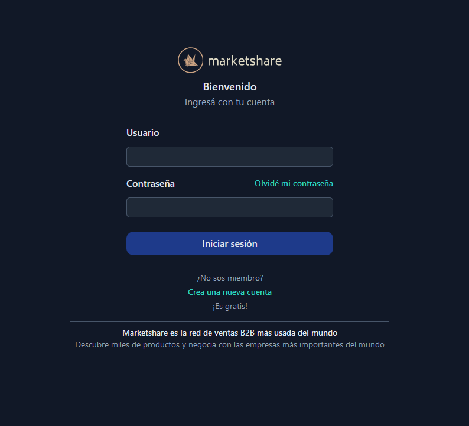
  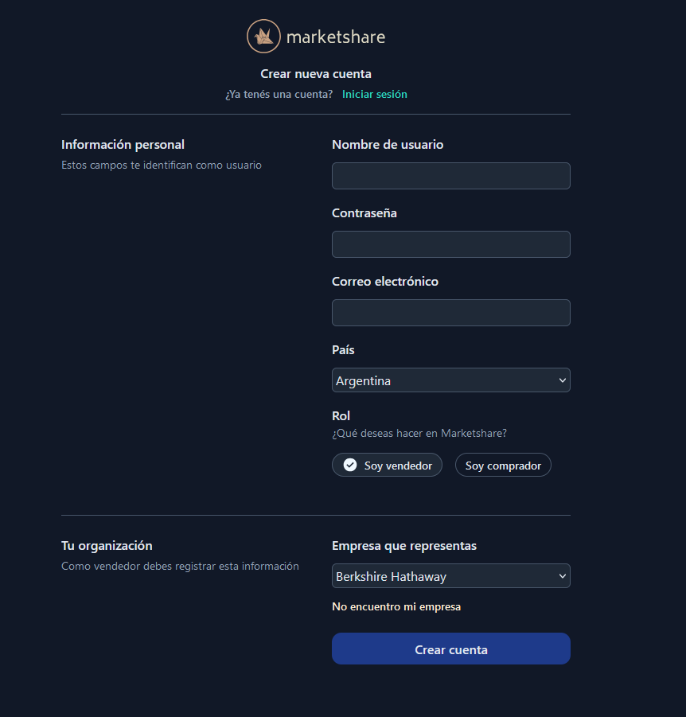

### A seller's home page showing products and clients' orders

  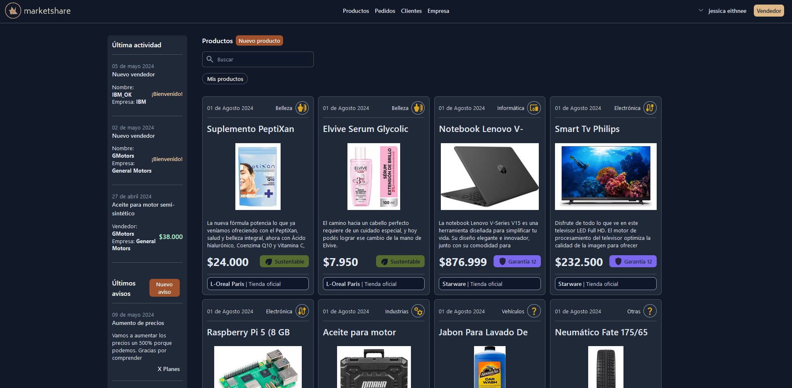
  

### A product's page showing product's features and reviews

  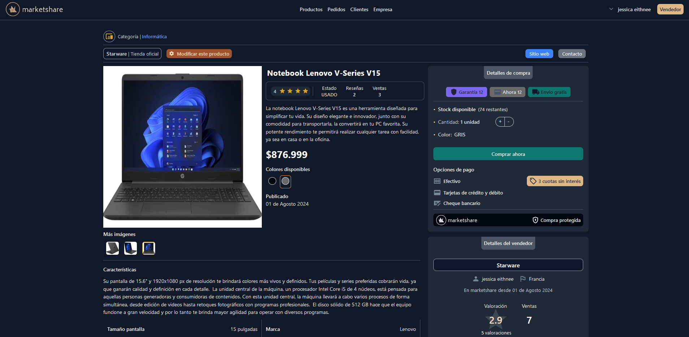
  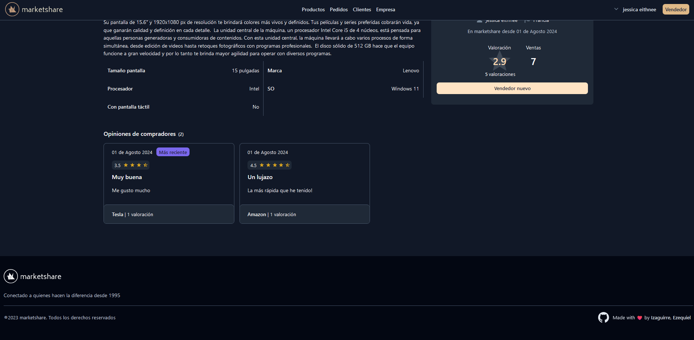

### A consumer's profile page

  

### Page to create/modify a product | Reviewing a product

  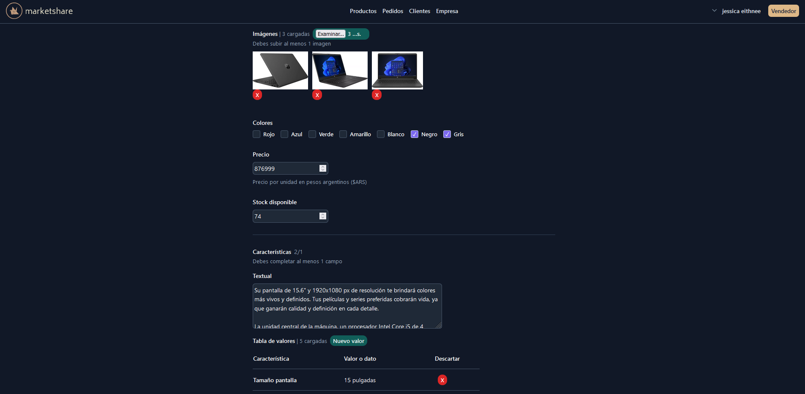
  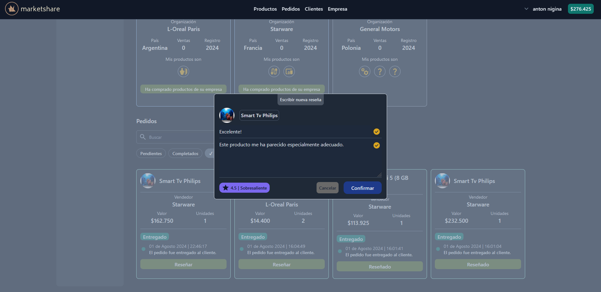

### A 'welcome' postcard email | A postcard informing your purchase order has been received.

  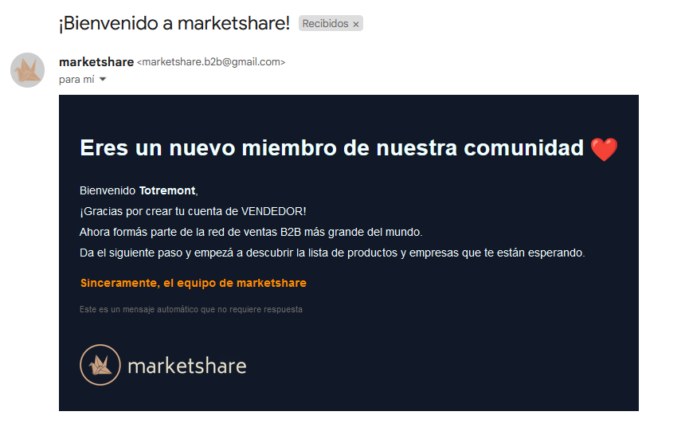
  

### Some testing made with Insomnia

  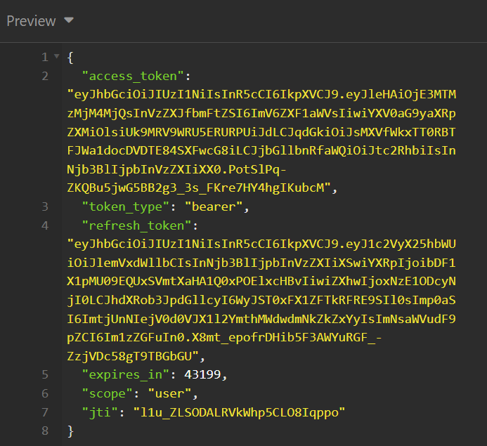
  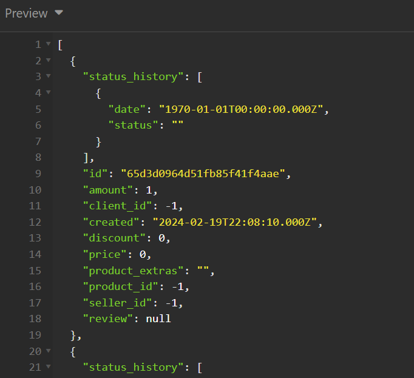
  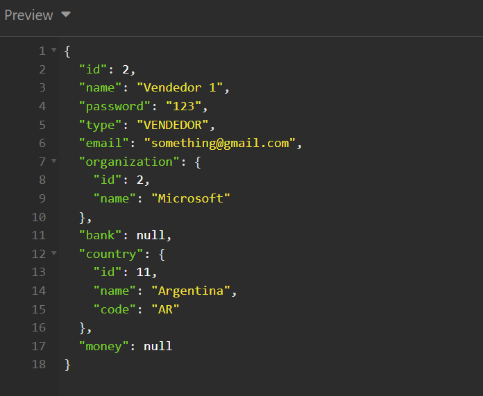

# How to deploy the application

### Run using docker-compose
If you want to run this application on Windows 10/11 do the following.

1. Inside the `.env` file on the `ms_pedidos` folder make the `DATABASE_URL` point to your desired mongoDB server.
2. Build the six required images using the `Dockerfiles` located under the microservices' directory. 
3. Edit the `compose.yaml` file inside `/compose` and put your images and any other configuration you want.
4. Run `docker compose up`.

### Run on a local cluster

> [!NOTE]
> I assume you already have [minikube](https://minikube.sigs.k8s.io/docs/) installed. Your cluster must have at least 8 GB RAM and 4 CPU cores or performance will be compromised.

0. Follow the previous 1 and 2 steps to build each microservice image.
1. Build the database images from their `Dockerfiles` located under `/compose`.
2. Use `minikube image load <your image>` to install your images inside of Minikube.
3. Run `minikube start --memory <your memory> --cpus=<your cores>` to create the cluster.
4. Inside `/kubernetes` you can find the definitions to apply the deployments, pods and services.
   - `kubernetes-commands.txt` contains commands to install additional resources that are required to make all of this work. For additional information you should read the corresponding documentation. 
   - `volumes` creates persistent volumes and claims. Data is stored under minikube's `/data/` folder and is [automatically persisted on the host](https://minikube.sigs.k8s.io/docs/handbook/persistent_volumes/).
   - `api-gateway` definitions to create an `HAProxy` gateway using Kubernetes's Gateway API. It contains a single `TCPRoute` that attaches on port 80 and forwards to the frontend service.
   - `grafana` contains a single definition with an authorization policy that grants Grafana access to Viz's prometheus.

